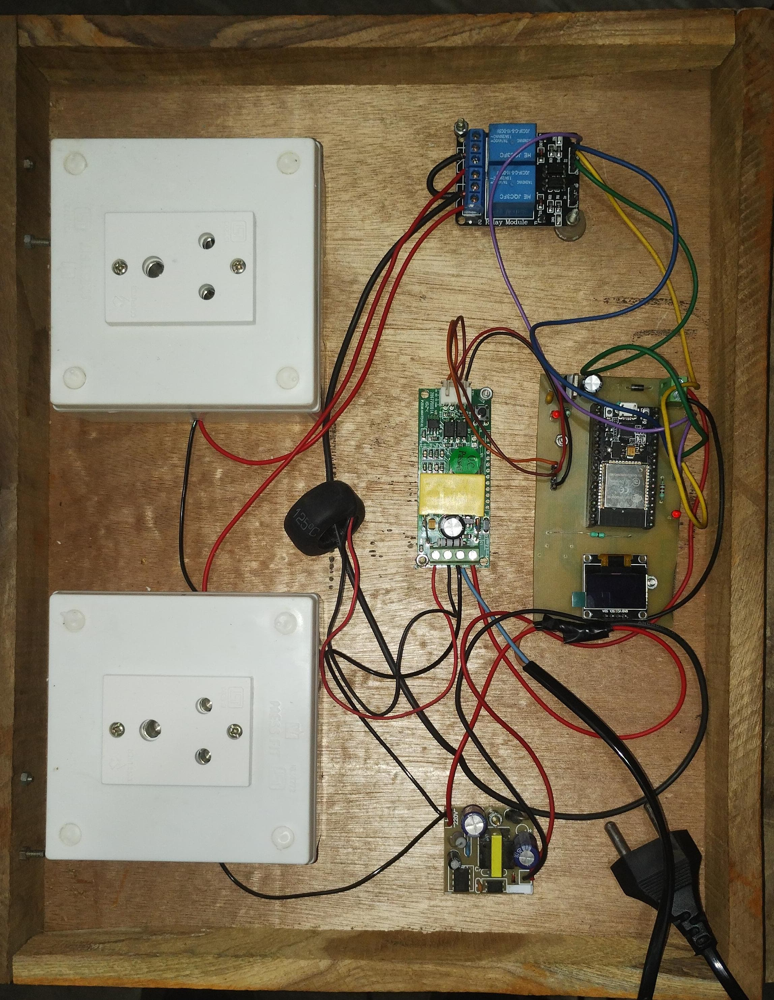

# ESP32 Power monitoring and control   **updated     

  

### ESP32 as main role
### PZEM as modbus interface
### statemachine driven as per client read client data for more info 

PCB is inside KICAD@8.0.56 folder   
final code in pzem_iot.ino file   
report materrial is in reports section   
    

       
     
